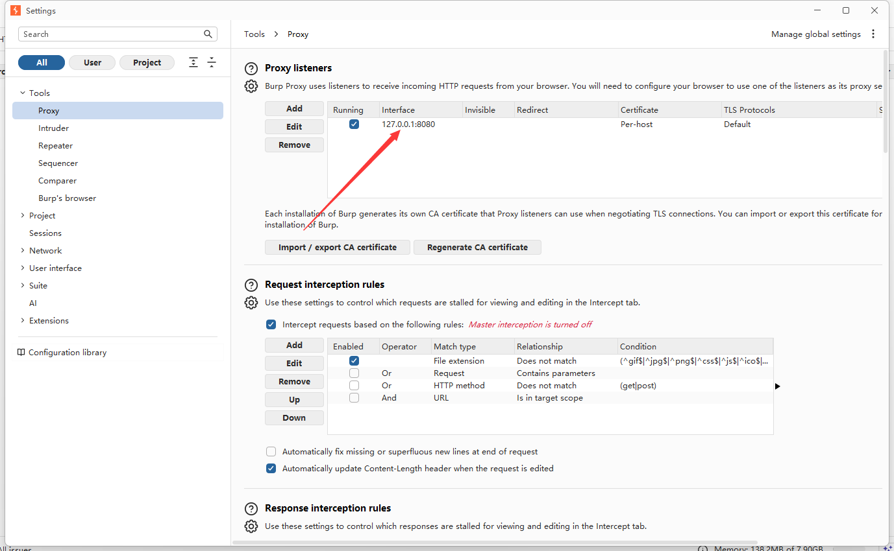
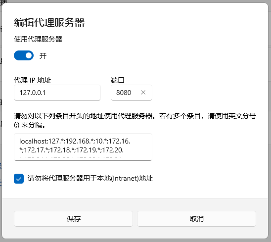
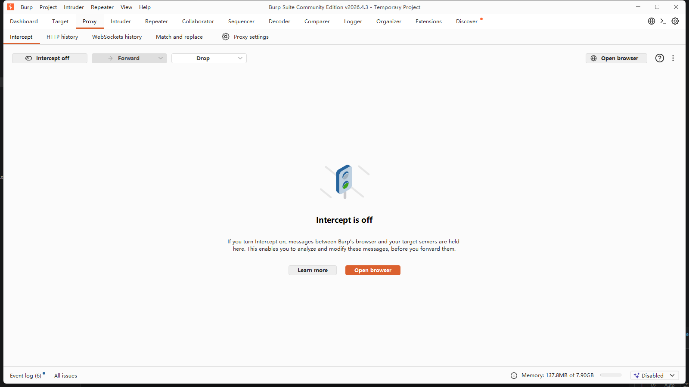
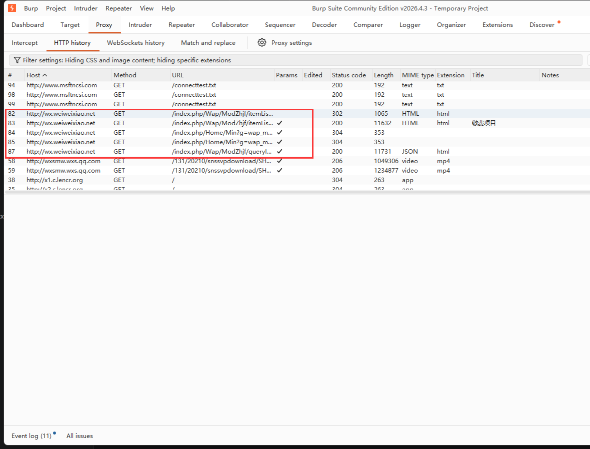
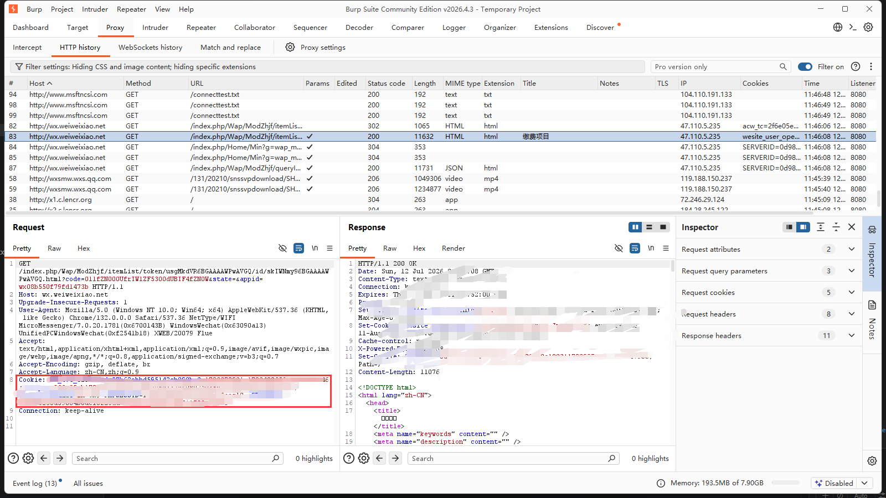

# cookie 获取方式

因为微信有pc版，因此我们一律使用在pc版微信抓包得到的cookie。当然，如果你有办法在手机上抓包，也可以使用支付宝版本的cookie。

## 工具

这里演示我使用 `BurpSuite` ，这是一个比较重的分析工具，你完全可以按照自己的喜好选择不同的抓包工具。原理基本上都是作为一个http代理，代理所有http请求，这样就能查看实际的请求内容和响应内容。

## 设置代理地址

## 设置系统代理

以 windows11 为例，在设置中打开 网络和Internet设置->代理->手动代理设置。

## 抓包

在 `BurpSuite` 的 `Proxy -> Intercept` 选项下，确认 `Intercept` 处于关闭状态。

在微信中访问 `http://wx.weiweixiao.net/index.php/Wap/ModZhjf/itemList/token/usgMkdVR6BGAAAAWPwAVGQ/id/skIWNmy96BGAAAAWPwAVGQ.html`
等待页面正常加载后，回到 `BurpSuite`，查看 `http history` 选项卡，在其中找到 `wx.weiweixiao.net` 的请求。

找到第一个响应为200的请求，复制其中的cookie字段。

